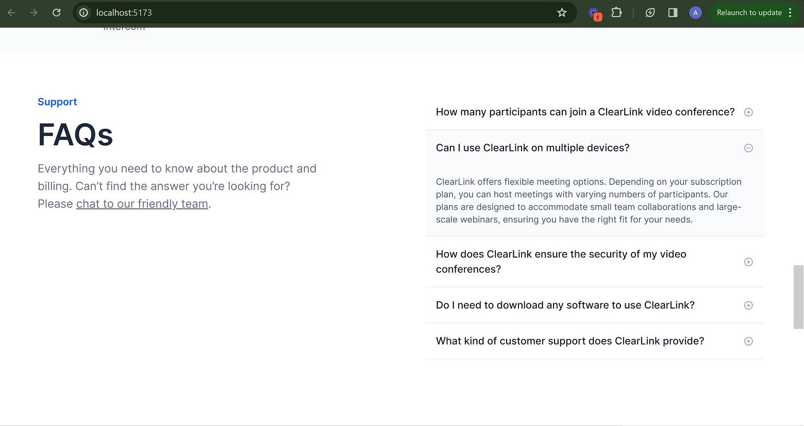

# Talentsync Test Submission

This is a solution to the Talentsync Technical Test

## Table of contents

- [Overview](#overview)
  - [The challenge](#the-challenge)
  - [Screenshot](#screenshot)
  - [Links](#links)
- [My process](#my-process)
  - [Built with](#built-with)
  - [Useful resources](#useful-resources)
- [Author](#author)

## Overview

### The challenge

The task is to perform a pixel-perfect integration of a provided [figma design](https://www.figma.com/file/fbhWiKFqJHyFvwqXNebQtv/Talentsync-Assessment-Task?node-id=2%3A9127&mode=dev), showcasing skills in front-end development.

### Screenshot


###

###

###


### Links

- Live Site URL: ()

## My process

### Built with

- TypeScript
- [React.js](https://react.dev/)
- [Tailwind](https://tailwindcss.com/)
- [ShadcnUI](https://ui.shadcn.com/)

## Getting Started

First, run the development server:

```bash
npm run dev
# or
yarn dev
# or
pnpm dev
# or
bun dev
```

Open [http://localhost:5173](http://localhost:5173) with your browser to see the result.

You can start editing the page by modifying `src/main.tsx`. The page auto-updates as you edit the file.


## Author

- Anderson Osayerie - [@andemosa](https://andemosa.vercel.app)
- Twitter - [@andemosa](https://www.twitter.com/andemosa)


# React + TypeScript + Vite

This template provides a minimal setup to get React working in Vite with HMR and some ESLint rules.

Currently, two official plugins are available:

- [@vitejs/plugin-react](https://github.com/vitejs/vite-plugin-react/blob/main/packages/plugin-react/README.md) uses [Babel](https://babeljs.io/) for Fast Refresh
- [@vitejs/plugin-react-swc](https://github.com/vitejs/vite-plugin-react-swc) uses [SWC](https://swc.rs/) for Fast Refresh

## Expanding the ESLint configuration

If you are developing a production application, we recommend updating the configuration to enable type aware lint rules:

- Configure the top-level `parserOptions` property like this:

```js
export default {
  // other rules...
  parserOptions: {
    ecmaVersion: 'latest',
    sourceType: 'module',
    project: ['./tsconfig.json', './tsconfig.node.json'],
    tsconfigRootDir: __dirname,
  },
}
```

- Replace `plugin:@typescript-eslint/recommended` to `plugin:@typescript-eslint/recommended-type-checked` or `plugin:@typescript-eslint/strict-type-checked`
- Optionally add `plugin:@typescript-eslint/stylistic-type-checked`
- Install [eslint-plugin-react](https://github.com/jsx-eslint/eslint-plugin-react) and add `plugin:react/recommended` & `plugin:react/jsx-runtime` to the `extends` list
